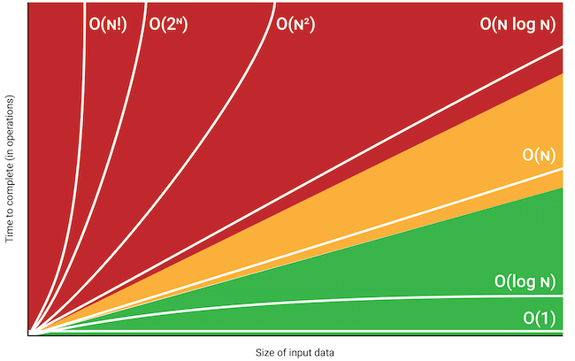

# 01 코딩 테스트
- 잘 짠 코드?
    1. 문제를 해결한 코드
    2. 가독성과 효율성

    >- `Stream()` 사용법
    >```
    >people.stream()
    >   .filter(p->p.hasPhoneNumber(number))
    >   .findFirst()
    >   .orElse(null)
    >```
    >여러 반복문을 이용해서 구현해야 할 코드를 매우 간단하게 작성할 수 있게 해준다.
    `Set<Person>`을 `Stream<Person>`로 변환 후, `filter(p->p.hasPhoneNumber(number))`를 사용해서 객체를 찾는다. `findFirst()` 메서드를 호출하여 찾은 객체가 있는지 검사하고 `orElse(null)` 메서드가 없다면 null을 반환하도록 한다.

# 02 시간 복잡도
- 빅오 표기법
    알고리즘이 겪을 수 있는 최악의 경우에 걸리는 시간과 입력 간의 상관관계
>시간 복잡도별 비교 그래프


# 03 배열
- 예제
    1. [교점에 별 만들기](https://school.programmers.co.kr/learn/courses/30/lessons/87377)
    2. [삼각 달팽이](https://school.programmers.co.kr/learn/courses/30/lessons/68645)
    3. [거리두기 확인하기](https://school.programmers.co.kr/learn/courses/30/lessons/81302)
    4. [행렬의 곱셈](https://school.programmers.co.kr/learn/courses/30/lessons/12949)

# 04 문자열
- 자주 쓰이는 메서드
>String.charAt(int index)
>String.toCharArray()
- 아스키 코드
> 'a' - 'A' = 대문자와 소문자간의 차이를 알수 있어 모든 아스키 코드를 외울 필요는 없다.
>> 내장라이브러리
>> Character.toUpperCase(char lower);
>> Character.toLowerCase(char upper);
- StringBuilder
    문자를 이어 붙이거나 빼는 등 수정할 때마다 새로운 문자열을 만들지 않고 내부 배열에서 직접 수정합니다. 
    기대 시간 복잡도 : O(1)
    > 저장하는 문자열이 너무 길어지면 배열 크기를 늘려 주어야합니다. 이 과정에서 새로운 배열을 할당하고, 기존 배열 내용을 새로운 배열로 옮겨야 하기 때문에 O(N)의 시간이 소요됩니다. 하지만 이 작업이 매번 발생하지 않고 가끔 발생하므로 기대 시간 복잡도는 O(1)이 됩니다.
    - 자주 사용되는 StringBuilder class 메서드
    StringBuilder.toString() : O(N)
    StringBuilder.append(char c) : O(1)
    StringBuilder.length() : O(1)
    StringBuilder.reverse() : O(N)
- 자주 사용되는 String class 메서드
equals(String other)
length()
substring(int beginIndex, int endIndex)
toUpperCase()
toLowerCase()
- 진법 바꾸기
Integer.paseInt(String s, int radix) : radix 진법으로 숫자를 표현하는 문자열 s를 정수로 변환
Integer.toString(int v, int radix) : 정수 v를 radix 진법의 문자열로 변환
Long.parseLong(String s, int radix) : radix 진법으로 숫자를 표현하는 문자열 s를 정수로 변환
Long.toString(long v, int radix) : 정수 v를 radix 진법의 문자열로 변환
- 자주 사용되는 정규 표현식 (p.145)

# 05 재귀
1. 상태 정의하기
2. 종료 조건
3. 점화식
